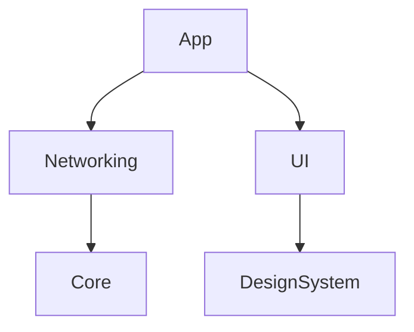

# SwiftUMLBridge & SwiftUMLStudio — Product Requirements Document

**Version 1.2 • May 2026 (Studio expansion)**

> SwiftUMLBridge is a Swift-native command-line tool and Swift Package that extends and modernizes SwiftPlantUML. SwiftUMLStudio is a macOS SwiftUI app built on top of SwiftUMLBridge, providing an interactive studio for generating, editing, and persisting Swift architecture diagrams.

---

## 1. Executive Summary

This document covers two related products developed in the same repository:

- **SwiftUMLBridge** — a modern, Swift-native CLI and Swift Package that evolves and extends SwiftPlantUML. It adds Swift Concurrency / actor / macro support, introduces Mermaid.js and Nomnoml output, and generates class, sequence, dependency, activity, state, and ER diagrams.
- **SwiftUMLStudio** — a macOS SwiftUI application that embeds the SwiftUMLBridge framework and provides a project workspace, native-canvas diagram rendering, persistent snapshots, architecture insights, and a paid-tier subscription experience.

This PRD defines the functional scope, architecture, roadmap, and success metrics for both products through their respective v1.0 releases.

---

## 2. Background & Problem Statement

SwiftPlantUML (v0.8.1, 2023) was the only purpose-built Swift-to-UML tool in the ecosystem but is now effectively unmaintained. It does not support Swift 5.9+ features (actors, async/await, macros, modern module boundaries). As a result, diagrams are often incomplete or incorrect.

Additionally, SwiftPlantUML only emits PlantUML, requires a Java toolchain to render, and does not integrate cleanly with modern documentation stacks that prefer Mermaid.js or Structurizr DSL.

Beyond the CLI tooling gap, Swift teams also lack an interactive macOS app for exploring, editing, and persisting architectural diagrams as living artifacts. SwiftUMLStudio addresses that gap by treating diagrams as first-class, editable, persistable project assets — not throwaway exports.

---

## 3. Goals & Non-Goals

### 3.1 Bridge Goals (Framework / CLI)

- Maintain backward compatibility with SwiftPlantUML's CLI flags and configuration schema where practical
- Update parsing to support Swift 5.9+ (actors, macros, concurrency)
- Add Mermaid.js and Nomnoml as first-class output formats alongside PlantUML
- Generate sequence, dependency, activity, state, and ER diagrams in addition to class diagrams
- Support multi-module SPM projects with cross-module relationship tracking
- Provide GitHub Actions–friendly CI mode
- Maintain active release cadence with compatibility for each new Xcode release

### 3.2 Studio Goals (macOS App)

- Provide an interactive macOS workspace for generating, editing, and exporting Swift diagrams
- Render diagrams natively (SwiftUI / Core Graphics) for class / sequence / activity types, with WebView fallback for Mermaid and Nomnoml
- Persist projects, diagrams, and snapshots via SwiftData
- Surface architectural insights and suggestions through static analysis
- Offer a paid tier (StoreKit) for premium features (multi-project workspaces, snapshot diffs, advanced insights)
- Comply with App Store macOS distribution requirements

### 3.3 Non-Goals

- Runtime tracing or dynamic analysis
- Objective-C or mixed-language source support
- Full C4 model generation (future v2 consideration)
- IDE plugin (VS Code / JetBrains) — out of scope for v1.0
- iOS or iPadOS distribution of the Studio app
- Hosted SaaS / cloud rendering of diagrams

---

## 4. Target Users

### Bridge (CLI / Package)

- **Individual developers** onboarding to a new Swift codebase
- **Engineering leads** preparing ADRs, RFCs, or design reviews
- **Platform / infrastructure teams** integrating diagram generation into CI pipelines

### Studio (macOS App)

- **iOS / macOS developers** who want an in-IDE-adjacent experience for exploring and documenting architecture
- **Tech writers and architects** producing documentation snapshots they can re-generate as code evolves
- **Reviewers and auditors** comparing architectural snapshots over time (diff view)

---

## 5. Functional Requirements — SwiftUMLBridge (Framework / CLI)

### 5.1 Parsing & Language Support

- Parse all Swift type declarations (class, struct, enum, protocol, actor, extension)
- Resolve inferred types using macOS SDK (via SourceKitten)
- Represent Swift Concurrency constructs (async functions, actors)
- Handle macros via expansion when possible; otherwise emit placeholder nodes
- Parse access control modifiers and reflect visibility in diagrams

### 5.2 Class Diagram Generation

- Emit class diagrams in PlantUML, Mermaid.js, and Nomnoml
- Show inheritance, protocol conformance, composition
- Support filtering (paths, type patterns, extensions)
- Preserve SwiftPlantUML YAML schema; extend for new features
- Support multi-module SPM projects with module namespace labels

### 5.3 Sequence Diagram Generation

- Extract static call graphs from function bodies
- Generate sequence diagrams for a specified entry point
- Represent async calls distinctly
- Configurable call depth (default: 3)
- Flag unresolvable call targets (closures, dynamic dispatch)

### 5.4 Activity Diagram Generation

- Derive activity diagrams from imperative function bodies — branches (`if` / `guard`), loops (`for` / `while`), `switch` statements, and `do/catch`
- Emit PlantUML activity scripts and a native SVG layout
- Support `--entry <Type.method>` selection and depth limits

### 5.5 State Diagram Generation

- Detect state machines built around enum-driven state and explicit transition methods
- Emit PlantUML state diagrams
- Document supported enum/transition patterns and their limitations

### 5.6 Entity-Relationship Diagram Generation

- Detect SwiftData `@Model` types and `@Relationship` properties
- Emit ER diagrams in PlantUML and Mermaid
- Annotate cardinality and relationship inverses where derivable

### 5.7 Dependency Graph Generation

SwiftUMLBridge will introduce an optional dependency-graph analysis mode that visualizes structural relationships within a Swift codebase at both the module and type levels. Dependency graphs complement class and sequence diagrams by providing a high-level view of architectural coupling, layering, and cross-module interactions.

#### 5.7.1 Scope

The dependency graph feature focuses on **static analysis** of Swift source code, extracting relationships without executing the program. It supports:

- **Module-level dependency graphs**
    - Derived from SPM target dependencies, import statements, and cross-module type references
    - Useful for validating architectural boundaries and detecting unintended coupling
- **Type-level dependency graphs**
    - Shows how classes, structs, enums, protocols, and actors depend on one another
    - Includes inheritance, protocol conformance, composition, and generic constraints
- **Call-level dependency edges (optional)**
    - Aggregated from static call-graph analysis
    - Provides a coarse view of functional coupling without generating full sequence diagrams

#### 5.7.2 Functional Requirements

- Provide a CLI command: `swiftumlbridge deps [paths...] [options]`
- Support output formats:
    - **Mermaid.js** (default for Markdown workflows)
    - **PlantUML** (for teams already using UML tooling)
    - **GraphViz/DOT** (optional v1.1+ for large-scale graphs)
- Support filtering:
    - `--modules` (module-only graph)
    - `--types` (type-level graph)
    - `--exclude <pattern>` (exclude modules or types)
    - `--public-only` (ignore internal/private dependencies)
- Detect and annotate:
    - **Cycles** (module or type cycles)
    - **Cross-layer violations** (if a layer config is provided)
    - **Unresolved references** (e.g., macro-generated or external types)

#### 5.7.3 Non-Goals (v1)

- Full architectural rule engine (planned for v2.x)
- Runtime dependency tracing
- Visualization of file-level dependencies
- Automatic layering inference

#### 5.7.4 Output Examples

##### Mermaid.js (module graph)



##### PlantUML (type graph)

```
@startuml
A --> B : uses
B <|-- C : inherits
@enduml
```

#### 5.7.5 Use Cases

- **Architecture validation** — Ensure modules follow intended layering (e.g., UI → Domain → Data).
- **Refactoring planning** — Identify tightly coupled clusters before splitting modules.
- **Onboarding** — Provide a high-level map of the system for new developers.
- **CI enforcement** — Fail builds when new dependency cycles or forbidden edges appear.

#### 5.7.6 Integration With Existing Architecture

Dependency graph generation reuses the existing SwiftUMLBridge architecture:

- **Parsing Layer** extracts type references, imports, and call sites.
- **Model Layer** stores dependency edges as a graph structure.
- **Emitter Layer** outputs the graph in Mermaid.js, PlantUML, or DOT formats.

This ensures minimal duplication and consistent behavior across diagram types.

### 5.8 Output Formats

| Format | Class | Sequence | Activity | State | ER | Deps |
|---|---|---|---|---|---|---|
| PlantUML | Yes | Yes | Yes | Yes | Yes | Yes |
| Mermaid.js | Yes | Yes | — | — | Yes | Yes |
| Nomnoml | Yes | — | — | — | — | — |
| Native SVG (Studio) | Yes | Yes | Yes | — | — | Yes |
| GraphViz / DOT | — | — | — | — | — | Planned (v1.1+) |
| Structurizr DSL | Partial (v2) | — | — | — | — | — |

PNG / SVG rendering of PlantUML scripts is delegated to downstream tools; the Studio app's native renderers cover the most-used types in-app.

### 5.9 CLI Interface

Commands:

- `swiftumlbridge classdiagram [paths...] [options]`
- `swiftumlbridge sequence --entry <Type.method> [paths...] [options]`
- `swiftumlbridge activity --entry <Type.method> [paths...] [options]`
- `swiftumlbridge state [paths...] [options]`
- `swiftumlbridge er [paths...] [options]`
- `swiftumlbridge deps [paths...] [options]`

Common flags:

```
- --format <plantuml|mermaid|nomnoml>
- --output <browser|console|file>
- --config <path>
- --depth <n>
- --sdk <path>
- --ci, --verbose, --version, --help
```

### 5.10 CI / Automation Mode

- `--ci` flag suppresses browser launch, writes output to file, and exits non-zero on parse errors
- Publish GitHub Action (`swiftumlbridge-action`) — **planned**, not yet shipped
- Document Fastlane + Xcode Cloud integration

---

## 6. Functional Requirements — SwiftUMLStudio (macOS App)

### 6.1 Overview & Architecture

SwiftUMLStudio is a macOS SwiftUI application that embeds the SwiftUMLBridge framework. It is structured around three primary modes (see 6.2) that share a common rendering pipeline, persistence layer, and inspector.

The app uses:

- **SwiftUI** + the macOS 26 navigation split view for layout
- **`@Observable`** view models (`DiagramViewModel`) coordinating diagram generation
- **SwiftData** (`PersistenceController`, `DiagramEntity`, `ProjectSnapshot`) for project / snapshot persistence
- **Native canvas renderers** (`NativeDiagramView`, `NativeSequenceDiagramView`, `NativeActivityDiagramView`) implemented in SwiftUI / Core Graphics
- **WebKit fallback** (`DiagramWebView`, `MermaidHTMLBuilder`, `NomnomlHTMLBuilder`) for diagram formats without a native renderer
- **StoreKit 2** (`SubscriptionManager`, `SubscriptionProviding`, `Configuration.storekit`) for the paid tier

### 6.2 App Modes

Defined in `AppMode.swift`:

- **Document mode** — single-source flow: pick a file/folder, generate one diagram, edit, export. Closest to the original M1 GUI MVP.
- **Explorer mode** — file-tree-driven exploration (`ExplorerSidebar`, `ExplorerToolbar`, `ExplorerDetailView`); regenerate diagrams as the user navigates the source tree.
- **Project mode** — persistent workspace with `ProjectSnapshot`s, dashboard (`ProjectDashboardView`), architecture diff (`ArchitectureDiffView`), and history (`HistorySidebar`).

### 6.3 Diagram Rendering

- Render class, sequence, activity, state, ER, and dependency diagrams
- Native canvas renderer is the default for class / sequence / activity / dependency
- WebView fallback (planttext.com for PlantUML; locally bundled Mermaid / Nomnoml HTML) handles the rest
- `DiagramInspectorStrip` exposes per-diagram controls (depth, format, filters)
- Sequence and Activity have dedicated control panels (`SequenceControlsView`, `ActivityControlsView`)

### 6.4 Persistence & Snapshots

- `PersistenceController` — SwiftData model container
- `DiagramEntity` — persisted diagram with source paths, generated script, format, timestamps
- `ProjectSnapshot` — point-in-time project state (file inventory, type inventory, generated diagrams)
- `SnapshotManager` — create / list / diff snapshots
- `HistorySidebar` + `HistoryItemRow` — UI for browsing prior generations and snapshots

### 6.5 Subscription / Paywall

- `SubscriptionManager` (StoreKit 2) backed by `Configuration.storekit` for local testing
- `FeatureGate` — declarative gating of premium features
- `PaywallView` — purchase / restore UI
- `ReviewReminderManager` — App Store review prompts on milestone events
- Free tier: single-project, single-diagram generation; Premium tier: multi-project workspaces, snapshot diffs, advanced insights, all diagram types

### 6.6 Architectural Insights & Suggestions

- `ProjectAnalyzer` — derives metrics from a parsed project (type counts, coupling, depth)
- `InsightEngine` — converts metrics into surfaced insights (cycles, hotspots, untested types)
- `SuggestionEngine` + `SuggestionDispatcher` — actionable suggestions ("split this module", "add a protocol boundary") delivered into the dashboard

### 6.7 Source Viewing & Markup

- `SourceEditorView` — read-only source viewer with line numbers and syntax highlighting
- `MarkupView` — annotation overlay for diagrams (notes, highlights) tied to diagram entities

### 6.8 Studio Non-Goals

- Editing the Swift source (Studio is read-only for source files)
- Running the Swift compiler / build system
- Cloud sync of projects or snapshots (v1)
- iOS / iPadOS app

---

## 7. Non-Functional Requirements

| Requirement | Bridge target | Studio target |
|---|---|---|
| Parse time (50k LOC) | < 30s on Apple Silicon | < 5s additional UI overhead |
| Memory usage | < 512 MB | < 1 GB with 5 snapshots loaded |
| Xcode compatibility | Current + one prior major release | Same |
| Swift toolchain | Swift 6.0 (strict concurrency) | Same |
| macOS deployment target | n/a (Linux + macOS) | macOS 26.4+ |
| License | MIT (Bridge) | Closed-source / paid (Studio) |
| Test coverage | ≥ 80% | ≥ 70% (UI tests via XCTest) |

---

## 8. Proposed Technical Architecture

SwiftUMLBridge consists of three layers:

### Parsing Layer

Wraps SourceKitten to extract AST and resolve types. Must evolve with each Swift toolchain release.

### Model Layer

Language-agnostic representation of types, relationships, and call/control-flow graphs. Includes specialized graph builders for each diagram type.

### Emitter Layer

Format-specific emitters (PlantUML, Mermaid, Nomnoml). Adding a new format requires only a new emitter. The Studio app provides additional native (SwiftUI / Core Graphics) renderers that consume the same model layer, bypassing string emission.

The CLI is a thin wrapper over the framework. SwiftUMLStudio embeds the same framework as a Swift Package dependency.

---

## 9. Milestones & Scope

### 9.1 Shipped (as of 2026-05)

| Milestone | Scope | Shipped |
|---|---|---|
| M0 — Foundation | SwiftUMLBridge package, three-layer architecture | 2026-02 |
| M1 — Studio MVP | macOS SwiftUI app, file picker, PlantUML preview | 2026-02 |
| M2 — Mermaid + Nomnoml output | Class diagrams in Mermaid and Nomnoml | 2026-03 |
| M3 — Sequence diagrams | Static call graph + emitters + native renderer | 2026-04 |
| M4 — Dependency graphs | `deps` CLI + Studio dependency view | 2026-04 |
| M5 — Activity diagrams | `activity` CLI + native SVG renderer | 2026-04 |
| M6 — State diagrams | `state` CLI + PlantUML emitter | 2026-04 |
| M7 — ER diagrams | `er` CLI + Studio rendering for SwiftData `@Model` types | 2026-04 |
| M8 — Studio workspace | Project mode, snapshots, dashboard, architecture diff, insights | 2026-04 |
| M9 — Subscription tier | StoreKit integration, paywall, feature gating | 2026-04 |
| M10 — Swift 6 strict concurrency | Full `Sendable` migration, async `DiagramPresenting` protocol | 2026-04 |

### 9.2 Roadmap (planned)

| Milestone | Scope | Target |
|---|---|---|
| M11 — CI / GitHub Action | Publish `swiftumlbridge-action`; document Xcode Cloud | TBD |
| M12 — Multi-module SPM | Cross-module type resolution; module namespace labels | TBD |
| M13 — Bridge v1.0 release | Homebrew formula, SPI listing, announcement, migration guide | TBD |
| M14 — Studio v1.0 (App Store) | App Store submission, sandboxing audit, marketing site | TBD |
| M15 — Documentation push | Tutorials, sample projects, troubleshooting guide | TBD |
| M16 — DOT / GraphViz output | Optional emitter for large-scale dependency graphs | v1.1+ |
| M17 — Macro expansion handling | Better fidelity for macro-generated types | v1.1+ |

---

## 10. Risks & Mitigations

| Risk | Likelihood | Mitigation |
|---|---|---|
| SourceKitten lags behind Swift toolchain | Medium | Contribute upstream; maintain fork |
| Static call analysis too inaccurate | Medium | Document limitations; allow manual overrides |
| SourceKit API changes | Low | Abstract SourceKit behind interface |
| Low community adoption (Bridge) | Medium | Publish to Homebrew + SPI; blog post; RFC process |
| App Store rejection (Studio) | Medium | Sandbox audit before submission; avoid private APIs |
| StoreKit fraud / refund volume | Low | Use App Store managed subscriptions; offer trial |
| Snapshot DB migration breakage | Medium | Versioned SwiftData schema; export-to-JSON safety net |

---

## 11. Success Metrics

### Bridge

- 100 GitHub stars within 60 days of v1.0
- Zero P0 bugs 30 days post-release
- Correct class diagrams validated against 10 OSS Swift projects
- ≥ 80% sequence diagram accuracy on curated corpus
- CI mode adopted in ≥ 3 public Swift projects within 90 days

### Studio

- 500 downloads within 60 days of App Store launch
- ≥ 4.0 average App Store rating
- ≥ 5% free→paid conversion on the paywall
- Zero crash-free-session regressions across point releases

---

## 12. Open Questions

- Should v1 support `.xcframework` parsing?
- How should macro-generated code be handled? (See M17 — partial mitigation planned)
- Is there demand for a VS Code extension? (Out of scope for v1.0)
- Should Studio support iCloud-backed snapshot sync for paid users?
- Should the free tier of Studio be ad-supported, or strictly limited?
- ~~Should fixes be upstreamed to SwiftPlantUML or diverge immediately?~~ **Closed** — SwiftUMLBridge is a ground-up rewrite.

---

## 13. Developer Experience & Documentation

### Bridge

- "Getting Started" guide with minimal configuration
- Sample projects demonstrating class, sequence, activity, state, ER, and dependency diagrams
- Troubleshooting guide for common SourceKit issues
- Migration guide for SwiftPlantUML users

### Studio

- In-app onboarding tour (first-launch)
- User guide hosted alongside the app website
- Tutorial covering: open project → generate diagram → snapshot → diff
- Help menu links to keyboard shortcut reference

---

## 14. Telemetry & Observability

Optional, opt-in:

- **Bridge** — anonymous usage metrics (format usage, error types); crash reporting for CLI failures; CI mode logs suitable for GitHub Actions annotations
- **Studio** — anonymous usage metrics (mode usage, diagram type counts); MetricKit-based crash reporting; paywall funnel analytics (subscription tier conversions, restore success rates)

---

## Appendix: Key Dependencies

| Dependency | Role | License |
|---|---|---|
| SourceKitten | AST parsing | MIT |
| Swift Argument Parser | CLI | Apache 2.0 |
| Yams | YAML parsing (6.0.0+) | MIT |
| PlantUML | Rendering (optional, external) | GPL / MIT |
| Mermaid.js | Rendering (optional, bundled in Studio) | MIT |
| Nomnoml | Rendering (optional, bundled in Studio) | MIT |
| SwiftData | Studio persistence | Apple SDK |
| StoreKit 2 | Studio subscriptions | Apple SDK |
| WebKit | Studio diagram fallback | Apple SDK |
